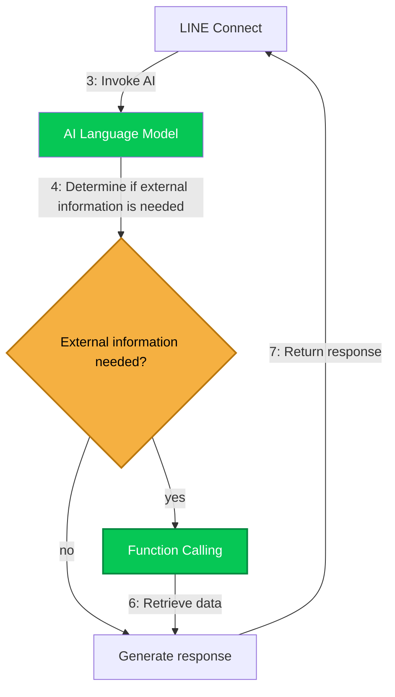

# AI Response

AI is invoked and generates a response when all of the following conditions are met:

1. “Auto response by AI” is enabled in settings.  
2. A text message is received from the user.  
3. No message response is generated by any triggers.

## Workflow



## Available LLMs

LLMs are called via APIs. The OpenAI API or any API compatible with OpenAI API can be used.

## Function Calling

In addition to the default functions, you can add custom functions via filter hooks.  
For instructions on adding functions, see the [Filter hooks](./filter.md) page.

## System Prompt 
You can pre-specify the AI's purpose, role, response style, and other behaviors.  
You can embed the current time and user information using the Twig template engine notation.  
Example:)
```
Current time: {{ "now"|date("Y-m-d H:i:s") }} 
WP user ID: {{ user.data.ID }} 
User name: {{ user.data.display_name }} 
Email address: {{ user.data.user_email }} 
```

## Current limitations

- Does not support multimodal input/output such as images.
