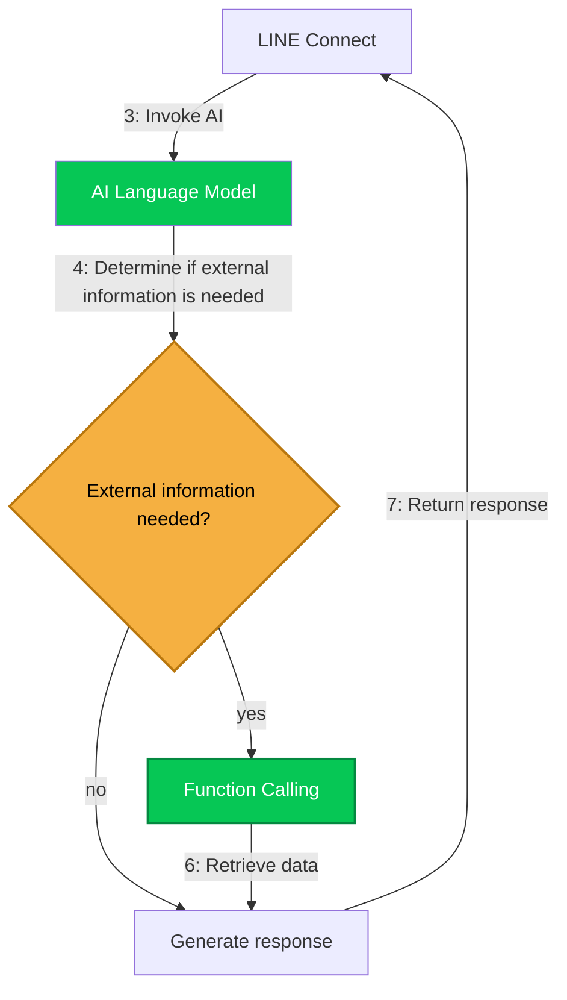

# AI Response

AI is invoked and generates a response when all of the following conditions are met:

1. “Auto response by AI” is enabled in settings.  
2. A text message is received from the user.  
3. No message response is generated by any triggers.

## Workflow


```mermaid
graph TB
    C[LINE Connect] -->|"3: Invoke AI"| D[AI Language Model]
    D -->|"4: Determine if external information is needed"| E{External information needed?}
    E -- yes --> F[Function Calling]
    E -- no --> H[Generate response]
    F -->|"6: Retrieve data"| H
    H -->|"7: Return response"| C

    style D fill:#06C755,color:white
    style F fill:#06C755,stroke:#048940,stroke-width:2px,color:white
    style E fill:#f5b041,stroke:#b9770e,stroke-width:2px,color:black
```

## Available LLMs

LLMs are called via APIs. The OpenAI API or any API compatible with OpenAI API can be used.  
Requests are sent to the configured `OpenAI API Endpoint` using the selected `API Key` and `Model`, so any chat/completions-compatible endpoint can be used.

## Function Calling

In addition to the default functions, you can add custom functions via filter hooks.  
For instructions on adding functions, see the [Filter hooks](./filter/index.md) page.
Even when `Function Calling` is enabled, only the functions selected in settings are sent to the model.  
If a function definition has a `role`, only users with the required capability can call it.  
Some functions return `response_mode: direct`, in which case the function's message is used directly instead of going through another AI generation step.

## System Prompt
You can pre-specify the AI's purpose, role, response style, and other behaviors.  
You can embed the current time, user information, and incoming event data using the Twig template engine notation.  
`webhook` contains the received event, including postback `data` and `params`.  
Example:)
```
Current time: {{ "now"|date("Y-m-d H:i:s") }}
WP user ID: {{ user.data.ID }}
User name: {{ user.data.display_name }}
Email address: {{ user.data.user_email }}
postback data: {{ webhook.postback.data }}
postback message id: {{ webhook.postback.params.slc_message_id }}
```

## Context
- Previous conversation logs are sent to the model up to the configured number of context items.
- If the user replies to a quoted message, the quoted message is also added to the prompt context.
- Image messages are passed to the model as `image_url`.
- Audio messages in history are handled as URL strings in context, not as native audio input.

## Other Settings
- `Temperature` controls response diversity. Higher values generally produce more varied output.
- `Max tokens` sets the maximum tokens used for a single response. `-1` uses the model limit.
- Daily usage limits can be configured separately for linked and unlinked users.
- When the limit is exceeded, the configured limit message is returned.

## Multimodal Input
- Supports image messages.
- To ask about an image, reply to that image message and send your text question.
- Sending plain text without replying to the image will not use the image as context.
