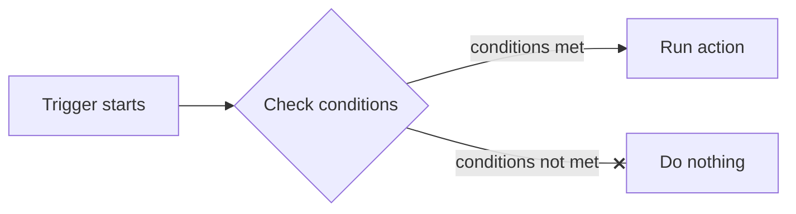

# Trigger

Trigger flow overview



## Trigger type

### Webhook

Execute actions when a webhook event matches the configured conditions.

#### Event type

Event types include message, postback, account link, add friend (follow), block (unfollow), and other webhook events.  
For details about event types, see [Receive messages (Webhook) | LINE Developers](https://developers.line.biz/en/docs/messaging-api/receiving-messages/#webhook-event-types).

#### Keywords

When the event type is `message` and the message type is `text`, or when the event type is `postback`, you can configure conditions for the received data.  
For text messages, the data is the received message. For postbacks, the data is the value of the `data` property.

##### Source

- Keyword: Treat the data as a string.
- Query string: Treat the data as a query string.

Source examples:

- Keyword: `Hello`
- Query string: `key=value&foo=bar`

##### Match type

When the source is `Keyword`, choose the matching method from contains / equals / starts with / ends with / regular expression.  
When the source is `Query string`, choose whether the specified parameter is included in the parsed query string data, or whether the parsed data must be exactly equal. The former allows extra parameters, while the latter does not.

#### Source conditions

These conditions determine whether the trigger should fire based on the source information of the received event.

##### Channel

Specifies the channel that received the webhook event.

##### Source

Specify the source as `User`, `Group`, or `Room`.

##### User

Configure whether to trigger based on the attributes of the user who sent the webhook event.

- Link status: Choose `Any`, `Linked`, or `Unlinked` based on the link status with a WordPress user.
- Role: Specify the user's role as a condition.
- LINE User ID: Specify a specific LINE user ID as a condition.

##### Group

Configure conditions based on the LINE group that sent the webhook event.

- LINE Group ID: Specify the originating LINE group ID as a condition.

##### Room

Configure conditions based on a multi-person chat room as the source of the webhook event.

- LINE Room ID: Specify the multi-person chat room ID as a condition.

##### Keyword/Source condition group

Group conditions together. You can configure multiple conditions so that the entire group matches when all conditions in the group match (AND), or when any one of them matches (OR).

##### Logical negation

Checking `Not` inverts the condition result. Specifically:

- If the condition matches, it is treated as not matching.
- If the condition does not match, it is treated as matching.

#### Action Hook

Use a WordPress action hook as the trigger to run actions when specific WordPress events occur.  
For example, you can send LINE notifications or run action flows when a user registers, logs in, saves a post, submits a comment, activates a plugin, or switches themes.

##### Available hooks

The following major hooks are predefined in the implementation. You can also extend them with a filter when needed.

| Display name | Hook name | Main arguments |
|---|---|---|
| User registration | `user_register` | `($user_id, $userdata)` |
| Login | `wp_login` | `($user_login, $user)` |
| Logout | `wp_logout` | `($user_id)` |
| Profile update | `profile_update` | `($user_id, $old_user_data, $userdata)` |
| Delete user | `delete_user` | `($id, $reassign, $user)` |
| Save post | `save_post` | `($post_id, $post, $update)` |
| Comment post | `comment_post` | `($comment_id, $comment_approved, $commentdata)` |
| Activate plugin | `activated_plugin` | `($plugin, $network_wide)` |
| Deactivate plugin | `deactivated_plugin` | `($plugin, $network_wide)` |
| Switch theme | `switch_theme` | `($new_name, $new_theme, $old_theme)` |

If you want to use a site-specific hook, you can add it through the `slc_filter_predefined_action_hooks` filter.  \
You can also use `slc_action_custom_hook` to pass any hook name and its argument array and treat it as an Action Hook.

##### Conditions

You can further narrow the trigger conditions based on the selected hook. If no condition is set, the trigger is considered valid as soon as the hook fires.

- `save_post`
  - You can narrow by post type.
  - You can narrow by post status.
  - Useful for excluding unnecessary saves such as revisions or autosaves.
- `wp_login`
  - You can narrow by the target user's role.
- `comment_post`
  - You can narrow by the target post type.
- Other hooks
  - If there are no hook-specific conditions, the event itself becomes the target.

##### Audience

For Action Hook triggers, you can choose the user that will be targeted by the action.

- `Use the current related user`
  - Automatically targets the user related to the hook.
  - Example: `user_register` targets the registered user, `wp_login` targets the logged-in user, and `save_post` can target the post author.
- `Specify audience`
  - Uses the normal audience conditions.

Even if you choose `Use the current related user`, if the user cannot be identified from the hook, the action runs without an audience.  \
For example, hooks such as `activated_plugin` or `switch_theme`, which are not directly tied to a user, may not be able to obtain the current administrator in admin screens.

##### How related users are determined per hook

`Use the current related user` infers the most natural user from the hook arguments.

| Hook name | Related user |
|---|---|
| `user_register` | Registered user |
| `wp_login` | Logged-in user |
| `wp_logout` | Logged-out user |
| `profile_update` | Updated user |
| `delete_user` | User being deleted |
| `save_post` | Post author |
| `comment_post` | Comment author |
| `activated_plugin` | Current administrator |
| `deactivated_plugin` | Current administrator |
| `switch_theme` | Current administrator |

##### Values available in actions

Hook arguments received by Action Hook can be referenced in actions and message templates.  \
In practice, they are stored under `action_hook.args`, so reference them like this:

- `{{$.action_hook.args.user_id}}`
- `{{$.action_hook.args.user_login}}`
- `{{$.action_hook.args.post_id}}`
- `{{$.action_hook.args.comment_id}}`
- `{{$.action_hook.args.plugin}}`
- `{{$.action_hook.args.new_theme}}`

Typical values by hook are listed below.

| Hook name | Reference example |
|---|---|
| `user_register` | `{{$.action_hook.args.user_id}}`, `{{$.action_hook.args.userdata}}` |
| `wp_login` | `{{$.action_hook.args.user_login}}`, `{{$.action_hook.args.user}}` |
| `wp_logout` | `{{$.action_hook.args.user_id}}` |
| `profile_update` | `{{$.action_hook.args.user_id}}`, `{{$.action_hook.args.old_user_data}}`, `{{$.action_hook.args.userdata}}` |
| `delete_user` | `{{$.action_hook.args.id}}`, `{{$.action_hook.args.reassign}}`, `{{$.action_hook.args.user}}` |
| `save_post` | `{{$.action_hook.args.post_id}}`, `{{$.action_hook.args.post}}`, `{{$.action_hook.args.update}}` |
| `comment_post` | `{{$.action_hook.args.comment_id}}`, `{{$.action_hook.args.comment_approved}}`, `{{$.action_hook.args.commentdata}}` |
| `activated_plugin` / `deactivated_plugin` | `{{$.action_hook.args.plugin}}`, `{{$.action_hook.args.network_wide}}` |
| `switch_theme` | `{{$.action_hook.args.new_name}}`, `{{$.action_hook.args.new_theme}}`, `{{$.action_hook.args.old_theme}}` |

##### How to use custom hooks

If you want to use a site-specific event as an Action Hook, follow these steps:

1. Add the hook you want to the predefined hook list.

```php
add_filter( 'slc_filter_predefined_action_hooks', function( $hooks ) {
	$hooks[] = 'my_custom_hook';
	return $hooks;
} );
```

2. Create a trigger that selects the added hook.

3. Call the custom hook entry point.

```php
do_action( 'slc_action_custom_hook', 'my_custom_hook', array(
	'arg1' => 'a',
	'arg2' => 1,
) );
```

On the action side, you can reference values like `{{$.action_hook.args.arg1}}`.

##### Example usage

1. Select `Action Hook` as the trigger type.
2. Select the hook you want to fire.
3. Configure conditions if needed.
4. Configure the audience if needed.
5. Build the action flow you want to run.

##### Use cases

- Notify administrators when a post is saved
- Send a message to the user when they log in
- Notify the author or moderator when a comment is posted
- Send alerts to operators when plugins or themes are changed
- Notify from site-specific events via `lineconnect_custom_hook`

##### Notes

Action Hook supports not only WordPress standard hooks but also custom hooks added by the site implementation.  \
However, which values are stored in `action_hook.args` depends on the hook argument structure. If needed, check the `ActionHooks` implementation or the custom hook definition.

### Schedule

Execute actions based on a specified date, time, day of the week, and so on.

#### Once

Set a one-time schedule.

- Date and time: Specify the date and time to trigger the action.

#### Repeat

##### Every hour

Triggers the action at the specified time each hour.

##### Every day of the week

Triggers the action on the specified day of the week.

- Calculation method: Determines how the weekday is calculated, either as the nth weekday of the month or the nth week of the month.
- Nth weekday / Nth week of the month: The meaning changes depending on the selected calculation method.
  - If `Nth weekday` is selected, choosing 1 means the first specified weekday of the month.
  - If `Nth week of the month` is selected, choosing 1 means the specified weekday in the first week of the month.
- Day: Specifies the day from Sunday to Saturday.
- First day of the week: Sets whether the week starts on Sunday or Monday when `Nth week of the month` is selected.

Example 1)

- Calculation method: Nth weekday
- Nth weekday / Nth week of the month: 1
- Day: Sunday  

In this case, the trigger fires on the first Sunday of the month (1/5).


Example 2)

- Calculation method: Nth week of the month
- Nth weekday / Nth week of the month: 1
- Day: Sunday
- First day of the week: Sunday

In this case, the day is Sunday in the first week of the month, but because the month starts on Wednesday, the first week does not include Sunday and the trigger does not fire.


- First day of the week: Monday

In this case, Sunday is included in the first week, so the trigger fires on 1/5.

##### Every day

Triggers the action on the specified date. If you check the last day of the month, the action triggers on the last day of that month.

##### Every week

Triggers the action in the specified week number of the year.

##### Every month

Triggers the action in the specified month.

##### Every year

Triggers the action in the specified year.

##### Start date

The trigger does not fire if the current time is before the start date.  
The start date and time are the reference point for scheduled values that do not map to a fixed date and time.  
Example: If the start date is `2024/05/15 21:38`:

- If you check 0 o'clock for Every hour, the trigger runs daily at 00:38.
- If you check the first Tuesday for Every day of the week, the trigger runs at 21:38 on the first Tuesday.
- If you check the 1st for Every day, the trigger runs at 21:38 on the 1st of each month.
- If you set the week number to 2 for Every week, the trigger runs at 21:38 on the first day of the 2nd week of the year (Wednesday in this example).
- If you check August for Every month, the trigger runs at 21:38 on August 15 of that year.

##### End date

The trigger does not fire if the current time is after the end date.

##### Advance notice

- Minutes of advance notice

  Enter a value to trigger the action the specified number of minutes before the target time.  
  For example, to trigger the action 24 hours before the last day of each month, check the last day of the month and enter `1440` for the advance notice minutes. This allows the trigger to fire one day before the last day of the month, even if the exact last day changes.

### Audience

This can be configured when the trigger type is `Schedule`. The audience specified here becomes the target of the action (the event source when the action runs).

If you do not specify an audience, the action runs without a target user, so actions that require a source will not work correctly.  
Also, even if you check `Send return value as LINE message`, no LINE message is sent unless an audience is specified.  
(Except when a user ID is specified in the action arguments.)

For details on configuring the audience, see [Audience](./audience.md).

When the trigger type is `Webhook`, the event sender becomes the target of the action and you cannot set an audience.

### Action

This is the action that runs when the trigger fires.  
For details about actions and chains, see [Action Flow](./actionflow.md).
