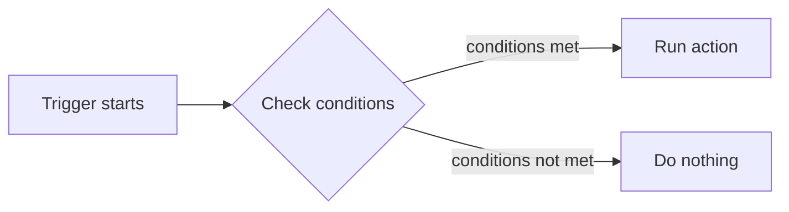

# Trigger
Trigger flow overview

## Trigger type

### Webhook
Execute an action when a webhook event matches the configured conditions.

#### Event type
Webhook event types include message, postback, account link, add friend (follow), block (unfollow), and others.  
For more information on event types, please see [Receive messages (webhook) | LINE Developers](https://developers.line.biz/en/docs/messaging-api/receiving-messages/#webhook-event-types).

#### Keywords
When the event type is `message` with a `text` message type, or when the event type is `postback`, you can specify conditions for the received data.  
For text messages, the data is the received message. For postbacks, the data is the contents of the `data` property.

##### Source
- Keyword: Treats data as a string
- Query string: Treats data as a query string

Source examples
- Keyword: `Hello`
- Query string: `key=value&foo=bar`

##### Match type
If the source is `Keyword`, select how to match it from Contains / Equals / Starts with / Ends with / Regular Expression.  
If the source is `Query string`, choose whether the specified parameter must be included in the parsed query string data, or whether the parsed data must be equal. The former allows extra parameters, while the latter does not.

#### Source conditions
These conditions determine whether the trigger should fire based on the source information of the received event.

##### Channel
Specifies the channel that received the webhook event.

##### Source
Specifies the source as `User`, `Group`, or `Room`.

##### User
Sets conditions to trigger based on the attributes of the user who sent the webhook event.
- Link status: Choose `Any`, `Linked`, or `Unlinked` based on the link status with the WordPress user.
- Role: Specify the user's role as a condition.
- LINE User ID: Specify a particular LINE user ID as a condition.

##### Group
Sets conditions based on the LINE group that sent the webhook event.
- LINE Group ID: Specify the originating LINE group ID as a condition.

##### Room
Sets conditions based on a multi-person chat room as the source of the webhook event.
- LINE Room ID: Specify the multi-person chat room ID as a condition.

##### Keyword/Source condition group
Groups conditions. You can set multiple conditions so that the whole group matches when all conditions in the group match (AND) or when any one of them matches (OR).

##### Logical negation
Checking `Not` inverts the condition result. Specifically:
- If the condition matches, it is treated as not matching.
- If the condition does not match, it is treated as matching.

##### Operator
Specifies how multiple conditions are handled.
- And: The whole set matches only when all conditions match.
- Or: The whole set matches when at least one condition matches.

### Action Hook
Use a WordPress action hook as the trigger to run actions when specific WordPress events occur.  
For example, you can send LINE notifications or run action flows when a user registers, logs in, saves a post, submits a comment, activates a plugin, or switches themes.

#### Hook
First, choose the event type you want to run. Common hooks include:

- User registration: `user_register`
- Login: `wp_login`
- Logout: `wp_logout`
- Profile update: `profile_update`
- Delete user: `delete_user`
- Save post: `save_post`
- Comment post: `comment_post`
- Activate plugin: `activated_plugin`
- Deactivate plugin: `deactivated_plugin`
- Switch theme: `switch_theme`

#### Conditions
You can further narrow the trigger conditions based on the selected hook.

- `save_post` can be restricted by post type or post status.
- `wp_login` can be restricted by the target user's role.
- `comment_post` can be restricted by the target post type.

#### Audience
Action Hook triggers let you choose the user who will be targeted by the action.

- Select `Use current related user` to automatically use the user related to the hook.
- Select `Specify audience` to use the normal audience conditions.

Even if you select `Use current related user`, if the user cannot be identified from the hook, the action runs without an audience.

#### Available values in actions
Hook arguments received by Action Hook can be referenced in actions and message templates.

- `{{$.action_hook.post_id}}`
- `{{$.action_hook.user_login}}`
- `{{$.action_hook.comment_id}}`

#### How to use
1. Select `Action Hook` as the trigger type.
2. Select the hook you want to fire.
3. Configure conditions if needed.
4. Configure the audience if needed.
5. Build the action flow you want to run.

#### Use cases

- Notify administrators when a post is saved
- Send a message to the user when they log in
- Notify the author or moderator when a comment is posted
- Alert operators when plugins or themes are changed

If your site adds custom hooks, you may be able to use those hooks as triggers.

### Schedule
Execute actions based on a specified date, time, or day of the week.

#### Once
Set a one-time schedule.
- Date and time: Specify the date and time to trigger the action.

#### Repeat
##### Every hour
Triggers the action at the specified time each hour.

##### Every day of the week
Triggers the action on the specified day(s) of the week.
- Calculation method: Specifies how to calculate the weekday, either as the nth weekday of the month or as the nth week of the month.
- Nth weekday / Nth week of the month: The meaning changes depending on the calculation method.
  - If `Nth weekday` is selected, choosing 1 means the first specified weekday of the month.
  - If `Nth week of the month` is selected, choosing 1 means the specified weekday in the first week of the month.
- Day: Specifies the day from Sunday through Saturday.
- First day of the week: Sets whether the week starts on Sunday or Monday when `Nth week of the month` is selected.

Example 1)
- Calculation method: Nth weekday
- Nth weekday / Nth week of the month: 1
- Day: Sunday  
In this case, the trigger fires on the first Sunday of the month (1/5).

Example 2)
- Calculation method: Nth week of the month
- Nth weekday / Nth week of the month: 1
- Day: Sunday
- First day of the week: Sunday
In this case, the day is the Sunday in the first week of the month, but because the month starts on Wednesday, the first week does not include Sunday and the trigger does not fire.

- First day of the week: Monday
  In this case, Sunday is included in the first week, so the trigger fires on 1/5.

##### Every day
Triggers the action on the specified date. Checking the last day of the month will trigger the action on the last day of that month.

##### Every week
Triggers the action in the specified week number of the year.

##### Every month
Triggers the action in the specified month.

##### Every year
Triggers the action in the specified year.

##### Start date
The trigger will not fire if the current time is before the start date.  
The start date and time are used as the reference point for scheduled values that do not map to a fixed date and time.  
Example: If the start date is `2024/05/15 21:38`:
- If you check 0 o'clock for Every hour, the trigger runs daily at 00:38.
- If you check the first Tuesday for Every day of the week, the trigger runs at 21:38 on the first Tuesday.
- If you check the 1st for Every day, the trigger runs at 21:38 on the 1st of each month.
- If you set the week number to 2 for Every week, the trigger runs at 21:38 on the starting day of the 2nd week of the year (Wednesday in this example).
- If you check August for Every month, the trigger runs at 21:38 on August 15 of that year.

##### End date
The trigger will not fire if the current time is after the end date.

##### Advance notice
- Minutes of advance notice
  Enter a value to trigger the action the specified number of minutes before the target time.  
  For example, to trigger the action 24 hours before the last day of each month, check the last day of the month and enter `1440` for the advance notice minutes. This allows the trigger to fire one day before the last day of the month, even if the exact last day changes.

### Audience
This can be configured when the trigger type is `Schedule`. The audience specified here becomes the target of the action (the event source when the action runs).
If you do not specify an audience, the action runs without a target user, so actions that require a source will not work correctly.  
Also, even if you check `Send return value as LINE message`, no LINE message is sent unless an audience is specified.  
(Except when a user ID is specified in the action arguments.)
For details on configuring the audience, see [Audience](./audience.md).
When the trigger type is `Webhook`, the event sender becomes the target of the action and you cannot set an audience.

### Action
This is the action that runs when the trigger fires.  
For details about actions and chains, see [Action Flow](./actionflow.md).

:::info[Check "Send return value as a LINE message"]
The return value is sent as a response message only when the trigger type is a Webhook event.  
If the trigger type is a schedule, checking this option does not send the return value as a LINE message.  
In that case, you can use the action chain feature to pass the return value as an argument to the `Send LINE Message` action and send a LINE message to the desired user.  
:::
