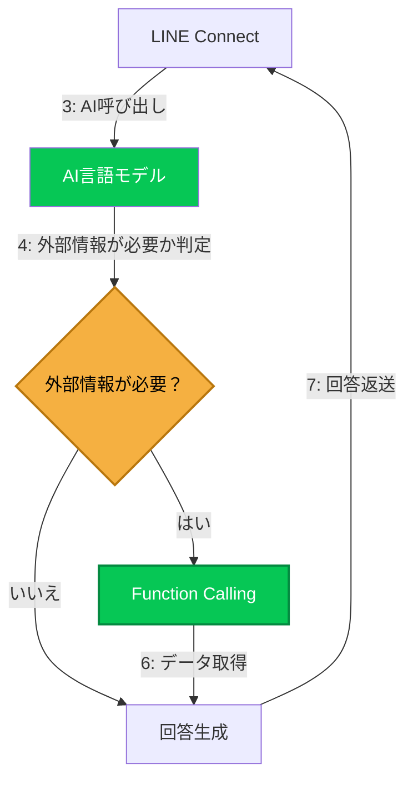

# AI応答
下記の条件をすべて満たす場合、AIが呼び出され応答が行われます。
1. 設定で「AIによる自動応答」が「有効」になっている
1. ユーザーからテキストメッセージが送られてきた場合
1. トリガーによる応答がない場合
## 処理の流れ


## 使用可能なLLM(大規模言語モデル)
LLMはAPIを通じて呼び出します。
OpenAI APIまたはOpenAI APIと互換性のあるAPIが使用可能です。

## Funcition Caling
デフォルトで用意されている関数のほか、独自の関数をフィルターフックで追加可能です。  
関数を追加する方法については[フィルターフック](./filter.md)のページを参照してください。

## システムプロンプト
AIの目的や役割、応答スタイルなど振る舞いをあらかじめ指定しておく事ができます。  
Twigテンプレートエンジンの記法で現在時刻や、ユーザーの情報を埋め込むことができます。  
例)
```
現在時刻: {{ "now"|date("Y-m-d H:i:s") }}
WPユーザーID: {{ user.data.ID }}
ユーザー名: {{ user.data.display_name }}
メールアドレス: {{ user.data.user_email }}
```

## 現在の制限
- 画像などマルチモーダル入力・出力には対応していません。