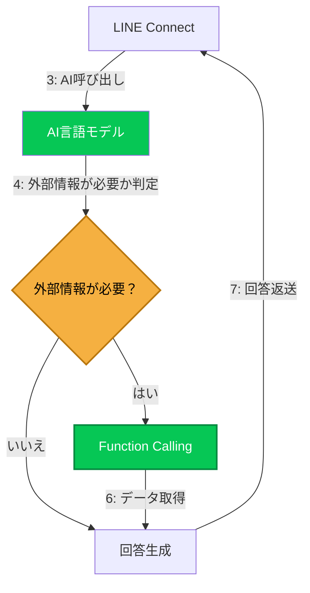

# AI応答
下記の条件をすべて満たす場合、AIが呼び出され応答が行われます。
1. 設定で「AIによる自動応答」が「有効」になっている
1. ユーザーからテキストメッセージが送られてきた場合
1. トリガーによる応答がない場合

## 処理の流れ

```mermaid
graph TB
    C[LINE Connect] -->|"3: AI呼び出し"| D[AI言語モデル]
    D -->|"4: 外部情報が必要か判定"| E{外部情報が必要？}
    E -- はい --> F[Function Calling]
    E -- いいえ --> H[回答生成]
    F -->|"6: データ取得"| H
    H -->|"7: 回答返送"| C

    style D fill:#06C755,color:white
    style F fill:#06C755,stroke:#048940,stroke-width:2px,color:white
    style E fill:#f5b041,stroke:#b9770e,stroke-width:2px,color:black
```

## 使用可能なLLM(大規模言語モデル)
LLMはAPIを通じて呼び出します。
OpenAI APIまたはOpenAI APIと互換性のあるAPIが使用可能です。  
設定した `OpenAI API Endpoint` と `API Key`、`Model` を使って、chat/completions 互換のエンドポイントにリクエストを送ります。

## Function Calling
デフォルトで用意されている関数のほか、独自の関数をフィルターフックで追加可能です。  
関数を追加する方法については[フィルターフック](./filter/index.md)のページを参照してください。
`Function Calling` を有効にしていても、実際にモデルへ渡されるのは設定で選択した関数だけです。  
また、関数定義に `role` がある場合は、その権限を満たすユーザーだけが呼び出せます。  
一部の関数は `response_mode: direct` を返し、その場合は AI の再生成を挟まず直接返信メッセージとして扱われます。

## システムプロンプト
AIの目的や役割、応答スタイルなど振る舞いをあらかじめ指定しておく事ができます。  
Twigテンプレートエンジンの記法で現在時刻や、ユーザーの情報、受信イベントの内容を埋め込むことができます。  
`webhook` には受信イベントが入り、postback の `data` と `params` も参照できます。  
例)
```
現在時刻: {{ "now"|date("Y-m-d H:i:s") }}
WPユーザーID: {{ user.data.ID }}
ユーザー名: {{ user.data.display_name }}
メールアドレス: {{ user.data.user_email }}
postback data: {{ webhook.postback.data }}
postback message id: {{ webhook.postback.params.slc_message_id }}
```

## 文脈
- 過去の会話ログは、設定した件数分だけモデルに渡されます。
- 返信元メッセージを引用して送った場合、その引用元メッセージも文脈に追加されます。
- 画像メッセージは `image_url` としてモデルに渡されます。
- 音声メッセージは文脈上では URL 文字列として扱われ、音声そのものの入力としては送られません。

## その他の設定
- `Temperature` は応答の多様性を調整します。値が高いほど出力のばらつきが大きくなります。
- `Max tokens` は1回の応答で使う最大トークン数です。`-1` の場合はモデルの上限を使います。
- 1日の利用回数制限は、未連携ユーザーと連携済みユーザーで別々に設定できます。
- 制限を超えた場合は、設定した制限メッセージが返されます。

## マルチモーダル入力
- 画像メッセージに対応しています。
- 画像に対して質問するには、その画像メッセージをリプライで引用してテキストを送信してください。
- 通常のテキスト送信だけでは画像を文脈として参照しません。
