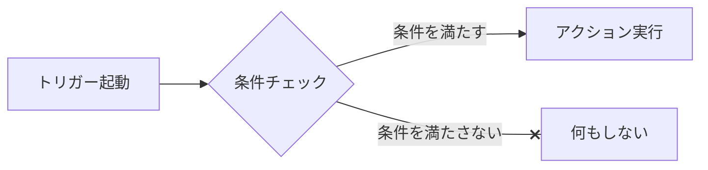

# トリガー
トリガーの基本フロー

## トリガータイプ

### Webhook
条件に一致するwebhookイベントをトリガーとしてアクションを実行します。
#### イベントタイプ
メッセージ/ポストバック/アカウント連携/友だち追加(フォロー)/ブロック(フォロー解除)などWebhookイベントの種類です。  
イベントタイプについて詳しくは[メッセージ（Webhook）を受信する | LINE Developers](https://developers.line.biz/ja/docs/messaging-api/receiving-messages/#webhook-event-types)をご覧ください。  
#### キーワード
イベントタイプが「メッセージ」で、メッセージタイプが「テキスト」の場合やイベントタイプが「ポストバック」の場合、受け取ったデータの条件を指定します。  
テキストメッセージを受信した場合、データは受け取ったメッセージ、ポストバックの場合は、dataプロパティの内容がデータとなります。
##### ソース
- キーワード: データを文字列として扱います
- クエリストリング: データをクエリ文字列として扱います

ソース例
- キーワード: 「こんにちは」
- クエリストリング: 「key=value&foo=bar」

##### マッチタイプ
ソースが「キーワード」の場合、キーワードを含む/等しい/で始まる/で終わる/正規表現のいずれかからマッチングの方法を選択します。  
ソースが「クエリストリング」の場合、指定したパラメーターがデータのクエリストリングをパースしたときのデータに含まれるか(それ以外のデータが含まれていても一致とみなす)、それとも等しいか(それ以外のデータが含まれている場合は一致とみなさない)を選択します。

#### ソース条件
受信したイベントのソース情報に基づいてトリガーを発動するかどうかを決定するための条件設定です。
##### チャネル
Webhookイベントを受信したチャンネルを指定します。
##### ソース
ソースには「ユーザー」「グループ」「ルーム」を指定します。
##### ユーザー
Webhookイベントを発行元(送信者)のユーザーの属性でトリガーを発動するかどうか条件設定を行います。
- 連携状態: Wordpressユーザーとの連携状態を条件として「いずれでも」「連携済み」「未連携」の中から選択します。
- ロール: ユーザーのロールを条件に指定します。
- LINEユーザーID: 特定のLINEユーザーIDを条件に指定します。
##### グループ
Webhookイベントの発行元としてLINEグループを条件として設定します。
- LINEグループID: 発行元のLINEグループIDを条件に指定します。
##### ルーム
複数人トークをWebhookイベントのソース条件として設定します。
- LINEトークルームID: 複数人トークルームのIDを条件として設定します。
##### キーワード/ソース条件グループ
条件をグループ化します。グループ内のソース条件がすべて一致する場合(AND)やいずれかが一致する場合(OR)に全体を一致とみなすように複数の条件を設定できます。
##### 論理否定
「否定」のチェックを入れると、条件の判定が反転します。具体的には、次のように動作します：
- 条件に一致する場合は、一致しないとみなされます。
- 条件に一致しない場合は、一致するとみなされます。
##### 演算子
複数の条件がある場合に、それらの条件をどのように扱うかを指定します。
- And: すべての条件が一致する場合にのみ、全体として一致するとみなされます。
- Or: 条件のうち少なくとも1つが一致する場合に、全体として一致するとみなされます。
### スケジュール
指定した日付や時刻、曜日などをトリガーとしてアクションを実行します。
#### 一度
一回限りのスケジュールを設定します。
- 日付時刻: トリガーを発動する日付時刻を指定します。
#### 繰り返し
##### 毎時
指定した時刻にトリガーが発動します。
##### 毎曜日
指定した曜日にトリガーが発動します。
- 計算方法: 曜日の計算方法です。月の第何曜日として計算するか、第何周目の何曜日として計算するかの指定です。
- 第何曜日/第何周目: 「計算方法」の選択により意味が異なります。
  - 「第何曜日」を選択していた場合、1を選んだ場合は第1◯曜日を指します。
  - 「月の第何周目」を選択していた場合、1を選んだ場合は、月の第1周目の◯曜日を指します。
- 曜日: 日曜日から土曜日までの曜日指定です。
- 週の最初の曜日:  「月の第何周目」を選択した場合に、週の最初を日曜日とするか、月曜日とするかを設定します。

例1)
- 計算方法: 第何曜日
- 第何曜日/第何周目:1
- 曜日: 日曜日  
この場合、月の第1日曜日(1/5)にトリガーが発動します。

例2)
- 計算方法: 月の第何周目
- 第何曜日/第何周目:1
- 曜日: 日曜日
- 週の最初の曜日: 日曜日
この場合、月の第1周目の日曜日となりますが、月が水曜日から始まるため、第1周目に日曜日は含まれず、トリガーは発動しません。

- 週の最初の曜日: 月曜日
の場合、第1周目に日曜日が含まれるため、1/5にトリガーが発動します。

##### 毎日
指定した日付にトリガーが発動します。月の最終日にチェックをいれると、その月の最終日にトリガーが発動します。
##### 毎週
指定した週番号の週にトリガーが発動します。
##### 毎月
指定した月にトリガーが発動します。
##### 毎年
指定した年にトリガーが発動します。
##### 開始日
現在時刻が開始日を過ぎていない場合はトリガーは発動しません。  
また、開始日と時刻は各種指定したスケジュールでは定まらない日付時刻の基準となります。  
例)開始日が「2024/05/15 21:38」の場合
- 毎時で0時にチェックを入れていたら、毎日0:38にトリガーが実行されます。
- 毎曜日で第1火曜日にチェックを入れていたら、第1火曜日の21:38にトリガーが実行されます。
- 毎日で1日にチェックを入れていたら、毎月1日の21:38にトリガーが実行されます。
- 毎週で週番号に2を指定していたら、その年の第2週目の開始日の曜日(2024/5/15は水曜日)21:38にトリガーが実行されます。
- 毎月で8月にチェックを入れていたら、その年の8/15 21:38にトリガーが実行されます。
##### 終了日
現在時刻が終了日を超えている場合、トリガーは発動しません。
##### 事前通知
- 事前通知する分数
入力すると、対象となる時刻よりも指定した分だけ事前にトリガーが発動します。  
例えば、毎月最終日の24時間前にトリガーを発動させたい場合、月の最終日にチェックをいれた上で、事前通知する分数に「1440」を入力します。こうすることで最終日が不定でも、その1日前にトリガーを発動できます。

### アクション
トリガーが発動した場合に実行するアクションです。  
以下の種類のアクションが用意されています。フィルターフックを利用して独自のアクションを追加することも可能です。
- 情報を取得して返すアクション
- 情報を検索して返すアクション
- メッセージ送信などの動作を行うアクション

アクションはAI応答のFunction Calling機能で使用するFunctionと共用です。
#### アクションの戻り値
##### 戻り値をLINEメッセージで送信
チェックをいれると、アクションの戻り値が、Webhookイベントの送信元に応答メッセージとして送信されます。  

戻り値の型によって、送信されるメッセージが異なります。
- 文字列: LINEテキストメッセージとして送信
- LINE\LINEBot\MessageBuilderのインスタンス: LINEメッセージオブジェクトとして送信
- その他: ダンプしたものをLINEテキストメッセージとして送信

:::info
応答メッセージとして送信されるのは、トリガータイプがWebhookイベントの場合のみです。  
トリガータイプがスケジュールの場合はチェックを入れても戻り値はLINEメッセージとしては送信されません。  
その場合、アクションチェイン機能を用いて「LINEメッセージ送信」アクションの引数にセットすることで、希望のユーザーへLINEメッセージを送信できます。  
:::

#### 変数の埋め込み
アクションの引数が文字列の場合、各変数を埋め込んで使用することができます。

##### アクションの戻り値
順次実行されていくアクションの戻り値を、それ以降のアクションの引数内のプレースホルダーで使用することができます。  
`{{$.return.アクション番号}}`  
アクション番号は、1から始まるアクションの順番です。  
対象アクションの戻り値が配列の場合、アクション番号に続けて「.キー」を追加することで、特定の値だけを取り出せます。  
例) アクション-1(アクション番号1)に「現在日時取得」アクションを設定します。  
アクション-2(アクション番号2)に「LINEテキストメッセージ取得」を設定します。  
アクション-2のparametersのbodyに「現在時刻は`{{$.return.1.datetime}}`です。」と入力します。  
これにより、現在時刻がメッセージ内に埋め込まれて送信されます。  

##### Webhookイベントデータ 
受信したWebhookイベントに含まれるデータを使用できます。  
`{{$.webhook.イベントオブジェクトのプロパティ}}`  
例)公式アカウントに送信されたテキストメッセージを使用する場合  
`{{$.webhook.message.text}}`

例)**ポストバックデータを使用する場合**
dataをそのまま使用する場合`{{$.webhook.postback.data}}`で使用できます。  
dataがクエリストリングの場合、パースしたものがparamsに入ります。  
例)**ポストバックでメッセージIDを指定して返信する**
dataが`action=message&slc_message_id=1354`の場合,slc_message_idの値である「1354」を取得するために`{{$.webhook.postback.params.slc_message_id}}`が使用できます。  
これを活用することで、`action=messagee`で発動する共通のトリガーを一つ作成し、アクションに「LINE Connectメッセージ取得」を設定し、アクションチェインで送信したいメッセージIDを注入すれば、一つ一つトリガーを作成する必要がなくなります。  
[設定例](/img/trigger/ex_postback_message.png)
例)**ポストバックでプロフィール項目を設定する**
dataが`action=profile&key=value`のポストバックを作成し、トリガーで`action=profile`で発動するように設定します。  
アクションで「LINEユーザープロフィール更新」を選択し、keyに`{{$.webhook.postback.params.key}}`,valueに`{{$.webhook.postback.params.value}}`を入力します。  
[設定例](/img/trigger/ex_postbak_update_profile.png)

##### ユーザーデータ
Webhookイベント送信元ユーザーのデータを使用できます。  
`{{$.user.WPUserオブジェクトのプロパティ}}`  
例）ユーザーの表示名を使用する場合  
 WordPressユーザーと連携済みの場合は、WordPressユーザーの表示名が、未連携の場合はLINEユーザーの表示名が取得できます。  
`{{$.user.data.display_name}}`  
LINEユーザーのプロフィール（プロフィール画像URLなど）は`{{$.user.profile.プロフィールプロパティ}}`で使用できます。  
プロフィールプロパティとして使える値は`displayName`、`pictureUrl`、`language`、`statusMessage`が標準で用意されています。  
加えて、プロフィール更新アクションで設定した独自の項目名も使用可能です。    

#### アクションチェイン
アクションの引数がオブジェクトやあらかじめ決められた定数から選択する形式の場合は変数の埋め込みが行えません。  
その場合、チェインルールを追加することで、任意のアクションの戻り値をそれ以降のアクションの引数に注入することができます。

##### 注入先引数
注入先引数の指定方法: `アクション番号.引数名`  
- アクション番号: 1から始まるアクションの順番
- 引数名: それぞれのアクションで必要とする引数に対応する名前
例）アクション-2のmessageを注入先引数として指定する場合: `2.message`  
(`{{ }}`で囲む必要がないことに注意してください）  

##### データ
注入するデータには文字列を使用したり、変数の埋め込みが可能です。  

