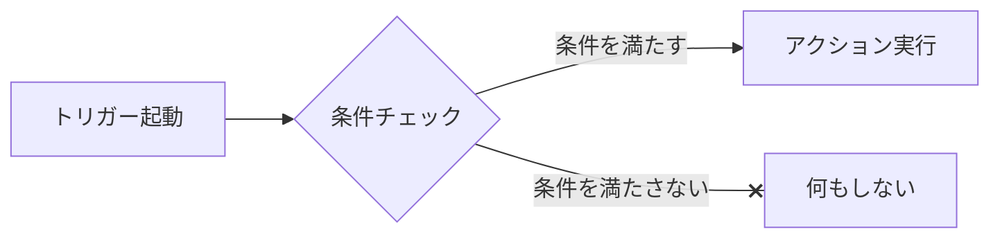

# トリガー
トリガーの基本フロー

```mermaid
flowchart LR
    A[トリガー起動] --> B{条件チェック}
    B --条件を満たす--> C[アクション実行]
    B --条件を満たさない--x D[何もしない]
```
## トリガータイプ

### Webhook
条件に一致するwebhookイベントをトリガーとしてアクションを実行します。
#### イベントタイプ
メッセージ/ポストバック/アカウント連携/友だち追加(フォロー)/ブロック(フォロー解除)などWebhookイベントの種類です。  
イベントタイプについて詳しくは[メッセージ（Webhook）を受信する | LINE Developers](https://developers.line.biz/ja/docs/messaging-api/receiving-messages/#webhook-event-types)をご覧ください。  
#### キーワード
イベントタイプが「メッセージ」で、メッセージタイプが「テキスト」の場合やイベントタイプが「ポストバック」の場合、受け取ったデータの条件を指定します。  
テキストメッセージを受信した場合、データは受け取ったメッセージ、ポストバックの場合は、dataプロパティの内容がデータとなります。
##### ソース
- キーワード: データを文字列として扱います
- クエリストリング: データをクエリ文字列として扱います

ソース例
- キーワード: 「こんにちは」
- クエリストリング: 「key=value&foo=bar」

##### マッチタイプ
ソースが「キーワード」の場合、キーワードを含む/等しい/で始まる/で終わる/正規表現のいずれかからマッチングの方法を選択します。  
ソースが「クエリストリング」の場合、指定したパラメーターがデータのクエリストリングをパースしたときのデータに含まれるか(それ以外のデータが含まれていても一致とみなす)、それとも等しいか(それ以外のデータが含まれている場合は一致とみなさない)を選択します。

#### ソース条件
受信したイベントのソース情報に基づいてトリガーを発動するかどうかを決定するための条件設定です。
##### チャネル
Webhookイベントを受信したチャンネルを指定します。
##### ソース
ソースには「ユーザー」「グループ」「ルーム」を指定します。
##### ユーザー
Webhookイベントを発行元(送信者)のユーザーの属性でトリガーを発動するかどうか条件設定を行います。
- 連携状態: Wordpressユーザーとの連携状態を条件として「いずれでも」「連携済み」「未連携」の中から選択します。
- ロール: ユーザーのロールを条件に指定します。
- LINEユーザーID: 特定のLINEユーザーIDを条件に指定します。
##### グループ
Webhookイベントの発行元としてLINEグループを条件として設定します。
- LINEグループID: 発行元のLINEグループIDを条件に指定します。
##### ルーム
複数人トークをWebhookイベントのソース条件として設定します。
- LINEトークルームID: 複数人トークルームのIDを条件として設定します。
##### キーワード/ソース条件グループ
条件をグループ化します。グループ内のソース条件がすべて一致する場合(AND)やいずれかが一致する場合(OR)に全体を一致とみなすように複数の条件を設定できます。
##### 論理否定
「否定」のチェックを入れると、条件の判定が反転します。具体的には、次のように動作します：
WordPress のアクションフックをトリガーとして、特定の WordPress イベント発生時にアクションを実行します。\
たとえば、ユーザー登録、ログイン、投稿保存、コメント投稿、プラグイン有効化、テーマ切り替えなどに合わせて、LINE 通知やアクションフローの実行を行えます。

### アクションフック
WordPressのフックをトリガーとして、アクションを実行します。
#### 使えるフック
次の主要フックを事前定義しています。また、必要に応じてフィルターで拡張できます。

| 表示名 | フック名 | 主な引数 |
|---|---|---|
| ユーザー登録 | `user_register` | `($user_id, $userdata)` |
| ログイン | `wp_login` | `($user_login, $user)` |
| ログアウト | `wp_logout` | `($user_id)` |
| プロフィール更新 | `profile_update` | `($user_id, $old_user_data, $userdata)` |
| ユーザー削除 | `delete_user` | `($id, $reassign, $user)` |
| 投稿保存 | `save_post` | `($post_id, $post, $update)` |
| コメント投稿 | `comment_post` | `($comment_id, $comment_approved, $commentdata)` |
| プラグイン有効化 | `activated_plugin` | `($plugin, $network_wide)` |
| プラグイン無効化 | `deactivated_plugin` | `($plugin, $network_wide)` |
| テーマ切り替え | `switch_theme` | `($new_name, $new_theme, $old_theme)` |

サイト独自のフックを使いたい場合は、`slc_filter_predefined_action_hooks` フィルターでフック名を追加できます。\
さらに、`slc_action_custom_hook` を使うと、任意のフック名と引数配列を渡して Action Hook として扱えます。

#### 条件
選択したフックに応じて、さらに発火条件を絞り込めます。条件を設定しない場合は、フックが発火した時点でトリガー条件を満たしたものとして扱われます。

- `save_post`
  - 投稿タイプで絞り込みできます。
  - 投稿ステータスで絞り込みできます。
  - `revision` や autosave のような不要な保存を除外したい場合に便利です。
- `wp_login`
  - 対象ユーザーのロールで絞り込みできます。
- `comment_post`
  - 対象投稿タイプで絞り込みできます。
- その他のフック
  - フック固有の条件が用意されていない場合は、フックが発火したイベントそのものを対象にします。

#### オーディエンス
Action Hook のトリガーでは、実行対象となるユーザーを選べます。

- `現在の関連ユーザーを使う`
  - フックに関連するユーザーを自動で対象にします。
  - 例: `user_register` なら登録されたユーザー、`wp_login` ならログインしたユーザー、`save_post` なら投稿者を対象にできます。
- `オーディエンスを指定する`
  - 通常のオーディエンス条件を使います。

`現在の関連ユーザーを使う` を選んだ場合でも、フックからユーザーを特定できないときは、オーディエンスなしでアクションが実行されます。\
たとえば、`activated_plugin` や `switch_theme` のように「ユーザーとは直接結びつかない」フックでは、管理画面での実行ユーザーが取得できない場合があります。

#### フックごとの関連ユーザーの考え方
`現在の関連ユーザーを使う` は、フック引数から意味的に最も自然なユーザーを推論します。

| フック名 | 関連ユーザー |
|---|---|
| `user_register` | 登録されたユーザー |
| `wp_login` | ログインしたユーザー |
| `wp_logout` | ログアウトしたユーザー |
| `profile_update` | 更新されたユーザー |
| `delete_user` | 削除されるユーザー |
| `save_post` | 投稿者 |
| `comment_post` | コメント投稿者 |
| `activated_plugin` | 現在の管理者 |
| `deactivated_plugin` | 現在の管理者 |
| `switch_theme` | 現在の管理者 |

#### アクションで使える値
Action Hook で受け取ったフック引数は、アクションやメッセージテンプレート内で参照できます。\
実際には `action_hook.args` 配下に格納されるため、次のように参照します。

- `{{$.action_hook.args.user_id}}`
- `{{$.action_hook.args.user_login}}`
- `{{$.action_hook.args.post_id}}`
- `{{$.action_hook.args.comment_id}}`
- `{{$.action_hook.args.plugin}}`
- `{{$.action_hook.args.new_theme}}`

フック別の代表的な値は次のとおりです。

| フック名 | 参照例 |
|---|---|
| `user_register` | `{{$.action_hook.args.user_id}}`, `{{$.action_hook.args.userdata}}` |
| `wp_login` | `{{$.action_hook.args.user_login}}`, `{{$.action_hook.args.user}}` |
| `wp_logout` | `{{$.action_hook.args.user_id}}` |
| `profile_update` | `{{$.action_hook.args.user_id}}`, `{{$.action_hook.args.old_user_data}}`, `{{$.action_hook.args.userdata}}` |
| `delete_user` | `{{$.action_hook.args.id}}`, `{{$.action_hook.args.reassign}}`, `{{$.action_hook.args.user}}` |
| `save_post` | `{{$.action_hook.args.post_id}}`, `{{$.action_hook.args.post}}`, `{{$.action_hook.args.update}}` |
| `comment_post` | `{{$.action_hook.args.comment_id}}`, `{{$.action_hook.args.comment_approved}}`, `{{$.action_hook.args.commentdata}}` |
| `activated_plugin` / `deactivated_plugin` | `{{$.action_hook.args.plugin}}`, `{{$.action_hook.args.network_wide}}` |
| `switch_theme` | `{{$.action_hook.args.new_name}}`, `{{$.action_hook.args.new_theme}}`, `{{$.action_hook.args.old_theme}}` |

#### カスタムフックの使い方
サイト独自のイベントを Action Hook として使いたい場合は、次の手順を踏みます。

1. **事前定義フック一覧に追加したいフックを追加**

```php
add_filter( 'slc_filter_predefined_action_hooks', function( $hooks ) {
	$hooks[] = 'my_custom_hook';
	return $hooks;
} );
```

2. **追加したフックを指定したトリガーを作成**


3. **カスタムフック受け口を呼び出す**

```php
do_action( 'slc_action_custom_hook', 'my_custom_hook', array(
	'arg1' => 'a',
	'arg2' => 1,
) );
```

アクション側では `{{$.action_hook.args.arg1}}` のように参照できます。

#### 使い方の例
1. トリガータイプで `Action Hook` を選択します。
2. 発火させたいフックを選択します。
3. 必要に応じて条件を設定します。
4. 必要に応じてオーディエンスを設定します。
5. 実行したいアクションフローを組み立てます。

#### 活用例

- 投稿が保存されたら、管理者に通知する
- ユーザーがログインしたら、本人へメッセージを送る
- コメントが投稿されたら、投稿者や担当者に通知する
- プラグインやテーマの変更時に、運用担当へアラートを送る
- サイト独自のイベントを `lineconnect_custom_hook` から通知する

#### 補足
Action Hook は WordPress の標準フックに加えて、サイト実装側で追加されたカスタムフックにも対応できます。\
ただし、どのフックでどの値が `action_hook.args` に入るかは、フックの引数構造に依存します。必要に応じて、`ActionHooks` の実装やカスタムフックの定義を確認してください。

### スケジュール
指定した日付や時刻、曜日などをトリガーとしてアクションを実行します。
#### 一度
一回限りのスケジュールを設定します。
- 日付時刻: トリガーを発動する日付時刻を指定します。
#### 繰り返し
##### 毎時
指定した時刻にトリガーが発動します。
##### 毎曜日
指定した曜日にトリガーが発動します。
- 計算方法: 曜日の計算方法です。月の第何曜日として計算するか、第何周目の何曜日として計算するかの指定です。
- 第何曜日/第何周目: 「計算方法」の選択により意味が異なります。
  - 「第何曜日」を選択していた場合、1を選んだ場合は第1◯曜日を指します。
  - 「月の第何周目」を選択していた場合、1を選んだ場合は、月の第1周目の◯曜日を指します。
- 曜日: 日曜日から土曜日までの曜日指定です。
- 週の最初の曜日:  「月の第何周目」を選択した場合に、週の最初を日曜日とするか、月曜日とするかを設定します。

例1)
- 計算方法: 第何曜日
- 第何曜日/第何周目:1
- 曜日: 日曜日  
この場合、月の第1日曜日(1/5)にトリガーが発動します。


例2)
- 計算方法: 月の第何周目
- 第何曜日/第何周目:1
- 曜日: 日曜日
- 週の最初の曜日: 日曜日
この場合、月の第1周目の日曜日となりますが、月が水曜日から始まるため、第1周目に日曜日は含まれず、トリガーは発動しません。

- 週の最初の曜日: 月曜日
の場合、第1周目に日曜日が含まれるため、1/5にトリガーが発動します。

##### 毎日
指定した日付にトリガーが発動します。月の最終日にチェックをいれると、その月の最終日にトリガーが発動します。
##### 毎週
指定した週番号の週にトリガーが発動します。
##### 毎月
指定した月にトリガーが発動します。
##### 毎年
指定した年にトリガーが発動します。
##### 開始日
現在時刻が開始日を過ぎていない場合はトリガーは発動しません。  
また、開始日と時刻は各種指定したスケジュールでは定まらない日付時刻の基準となります。  
例)開始日が「2024/05/15 21:38」の場合
- 毎時で0時にチェックを入れていたら、毎日0:38にトリガーが実行されます。
- 毎曜日で第1火曜日にチェックを入れていたら、第1火曜日の21:38にトリガーが実行されます。
- 毎日で1日にチェックを入れていたら、毎月1日の21:38にトリガーが実行されます。
- 毎週で週番号に2を指定していたら、その年の第2週目の開始日の曜日(2024/5/15は水曜日)21:38にトリガーが実行されます。
- 毎月で8月にチェックを入れていたら、その年の8/15 21:38にトリガーが実行されます。
##### 終了日
現在時刻が終了日を超えている場合、トリガーは発動しません。
##### 事前通知
- 事前通知する分数
入力すると、対象となる時刻よりも指定した分だけ事前にトリガーが発動します。  
例えば、毎月最終日の24時間前にトリガーを発動させたい場合、月の最終日にチェックをいれた上で、事前通知する分数に「1440」を入力します。こうすることで最終日が不定でも、その1日前にトリガーを発動できます。

### オーディエンス
トリガータイプが`スケジュール`の場合に設定できます。ここで指定したオーディエンスが、アクションの対象（アクションが実行される際のイベントソース）となります。
指定しない場合、対象となるユーザーが存在しない状態でアクションが実行されるため、ソース元が必要なアクションは正しく動作しません。  
また、`戻り値をLINEメッセージで送信`にチェックを入れても、オーディエンスが指定されていない場合、LINEメッセージは送信されません。  
（アクションの引数でユーザーIDを指定した場合は除く）
オーディエンスの設定方法は[オーディエンス](./audience.md)を参照してください。
なお、トリガータイプが`Webhook`の場合、イベントの送信元がアクションの対象となり、オーディエンスの設定はできません。

### アクション
トリガーが発動した場合に実行するアクションです。  
アクションやチェインの設定方法は[アクションフロー](./actionflow.md)を参照してください。
